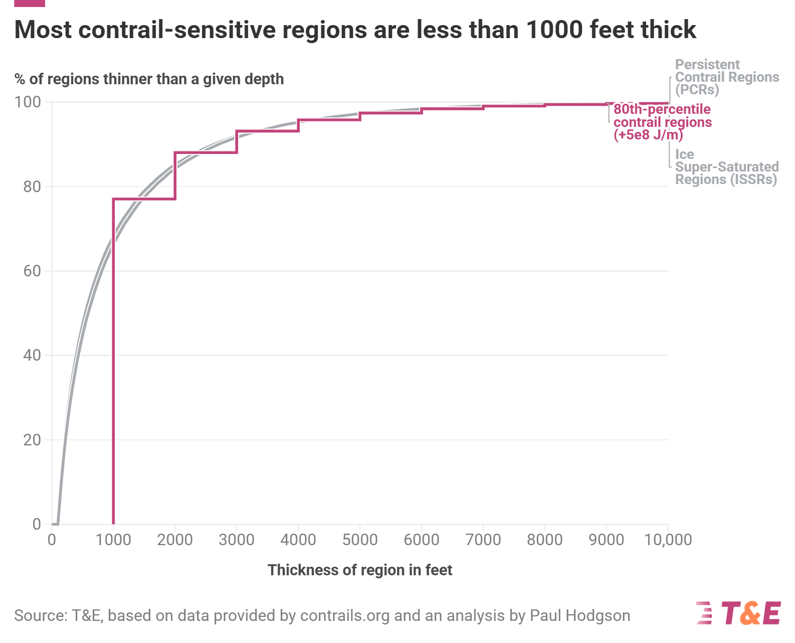

# Contrail Avoidance and Atmospheric Forcing Analysis (20251017_contrail_avoidance_atm)

This repository analyzes the **climatic impact of aviation contrails** using a combination of **traffic data, meteorological datasets, and contrail forcing simulations**.
It contains Jupyter notebooks, helper scripts, data, and visualizations exploring how **flight timing, routes, and airspace utilization** contribute to contrail formation and radiative forcing.


## 🧭 Project Overview

This project quantifies **contrail radiative forcing (RF)** over Europe and globally by analyzing:

* 2019 European flight departures and their contribution to warming,
* Gridded contrail forcing simulations using CoCiP,
* Identification of Ice-Supersaturated Regions (ISSRs),
* Evaluation of airspace “capacity” in terms of cooling vs. warming contrails.

The analysis supports ongoing research into **climate-optimized flight planning and contrail avoidance strategies**.


## 📂 Repository Structure

```
20251017_contrail_avoidance_atm
├─ 1_departures.ipynb
├─ 2_forcing.ipynb
├─ 3_issr.ipynb
├─ 4_airspace_capacity.ipynb
├─ supporting/
├─ data/
├─ figures/
├─ helpers/
├─ output/
├─ README.md
└─ requirements.txt
```

### Key Components

| Component                     | Description                                                                                                                    |
| ----------------------------- | ------------------------------------------------------------------------------------------------------------------------------ |
| **1_departures.ipynb**        | Analyzes 2019 European departures (incoming/outbound) to assess contrail forcing by **month**, **hour**, and **airport/FIR**.  |
| **2_forcing.ipynb**           | Examines **gridded contrail forcing outputs** for 2019 with ~20% lower total forcing (updated Pi-Contrails version).           |
| **3_issr.ipynb**              | Detects **Ice-Supersaturated Regions** (ISSRs) from CoCiP outputs (2024), evaluating their distribution and geometry.          |
| **4_airspace_capacity.ipynb** | Quantifies the **fraction of airspace volume** affected by warming/cooling contrails and analyzes it by flight level and time. |
| **supporting/**               | Contains supplementary notebooks for data acquisition and intermediate analyses.                                               |
| **data/**                     | Includes airports, FIRs, GeoJSON boundaries, and intermediate simulation results.                                              |
| **helpers/**                  | Python scripts for data conversion, downloads, and processing utilities.                                                       |
| **output/**                   | Generated CSV summaries and figures for visualization.                                                                         |
| **figures/**                  | Visualization outputs from each notebook (see below).                                                                          |


## 🧪 Core Analyses

### 1️⃣ Departures (`1_departures.ipynb`)

**Goal:** Quantify contrail forcing from 2019 European flights using the dataset by Roger Teel (based on his 2024 publication, yielding ~62 mW m⁻² forcing).

**Analyses:**

* Contrail forcing by **month of year** and **hour of day**
* Number of **“big hit”** flights (major warming contrails) by day, airport, and FIR
* Total CO₂ and contrail forcing per departure airport/FIR

**Figures:**

* 
* 
* 
* 
* 


### 2️⃣ Forcing (`2_forcing.ipynb`)

**Goal:** Evaluate **gridded forcing** from a newer 2019 simulation with ~20% lower total energy forcing.

**Analyses:**

* File availability and statistics of forcing datasets
* Forcing per **flight distance**, **hour**, **month**, **flight level**, and **FIR**
* Comparison of **traffic density** and **warming intensity**


**Figures:**

* 
* 
* 
* 
* 
* 
* 
* 
* 
* 

### 3️⃣ ISSRs (`3_issr.ipynb`)

**Goal:** Identify and characterize **Ice-Supersaturated Regions** (ISSRs) where persistent contrails form.
Data: CoCiP outputs for 2024, using Airbus A320 (η = 0.032) as the reference aircraft.

**Method:**

* Detect connected regions exceeding a **forcing threshold (5 × 10⁸ J m⁻¹)**
* Compute per-region statistics: centroid, forcing, flight level, thickness, area, and volume
* Compare distributions to **Paul Hodgins (2024)** results

**Figures:**

* 
* 


### 4️⃣ Airspace Capacity (`4_airspace_capacity.ipynb`)

**Goal:** Quantify **airspace capacity** in terms of contrail warming potential.

**Analyses:**

* Fraction of volume producing **cooling**, **warming**, and **highly warming** (80th / 95th percentile) contrails
* Aggregation by **week** and **flight level band**
* Derive **hourly and weekly statistics** for comparison

**Figures:**

* 
* 
* 
* 


## 🧩 Supporting Notebooks

| Notebook                                             | Purpose                                                                                             |
| ---------------------------------------------------- | --------------------------------------------------------------------------------------------------- |
| `20250808_Persistent_Contrails_From_ARCO_ERA5.ipynb` | Uses **FastMeteo** to download ERA5 weather data and map persistent contrail regions.               |
| `20250818_ACCF_and_GriddedCocip.ipynb`               | Compares **ACCFs** with **Gridded CoCiP** results.                                                  |
| `20250818_GAIA.ipynb`                                | Downloads and converts **GAIA** datasets to NetCDF format.                                          |
| `20250818_CoCiP.ipynb`                               | Demonstrates CoCiP usage for contrail simulations.                                                  |
| `20250821_Meteorological_Plots_ARCO_ERA5.ipynb`      | Plots meteorological parameters (T, RH, ISSR, SAC); loads one hour of ADS-B data from ADSBexchange. |
| `20251017_ADS-B_Traffic_Library_Demo.ipynb`          | Demonstrates loading and binning ADS-B traffic into FIRs.                                           |


## 🧰 Helper Scripts

Key Python utilities in the `helpers/` folder:

* `contrail_forcing_sum_pq_parallel.py` — parallel aggregation of parquet files
* `contrail_forcing_parquet_to_netcdf.py` — conversion to NetCDF
* `create_airspace_geojson.py` — generation of FIR and airspace polygons
* `download_adsb.py` — download ADS-B traffic data
* `gaia_parquet_to_netcdf.py` — GAIA dataset conversion


## 📊 Data

The `/data` directory includes:

* **Airports, FIR boundaries, and country metadata**
* **GeoJSON** and **CSV** files for spatial aggregation
* **Gridded forcing outputs** (`hourly_totals.csv`)
* **ISSR datasets** (`ISSR and PCR depth distribution.csv`)


## 📈 Outputs

Final CSV summaries in `/output` are used for visualization (e.g., via Flourish).
Each subfolder corresponds to a notebook (e.g., `/output/departures`, `/output/forcing`, `/output/issr`).


## ⚙️ Requirements

All dependencies are listed in `requirements.txt`.
Typical environment setup:

```bash
conda create -n contrail python=3.11
pip install -r requirements.txt
```


## 🧮 TODO

* [ ] Validate correctness of **gridded forcing summation**
* [ ] Automate generation of weekly summary plots
* [ ] Add references to published datasets and models (FastMeteo, CoCiP, GAIA)